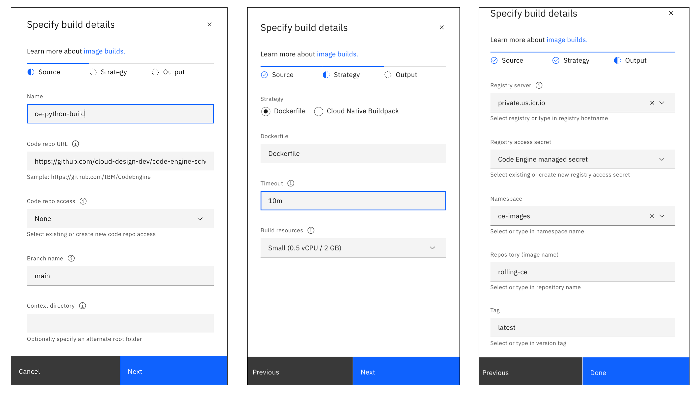
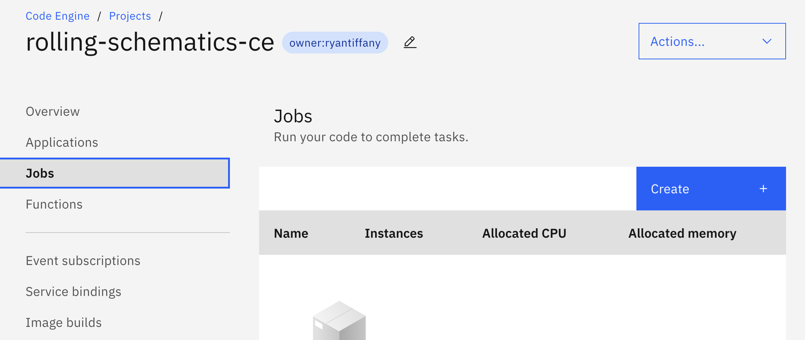
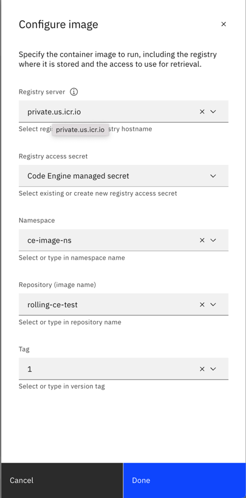
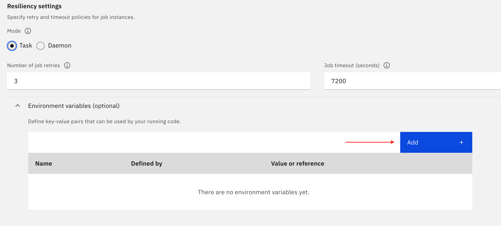
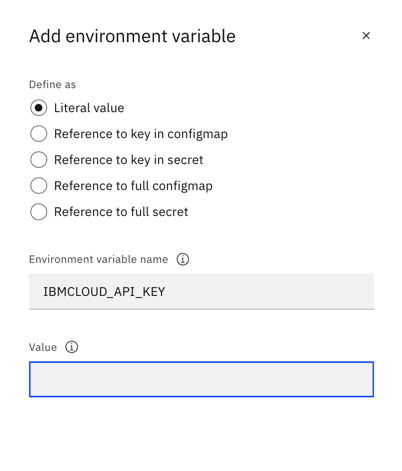
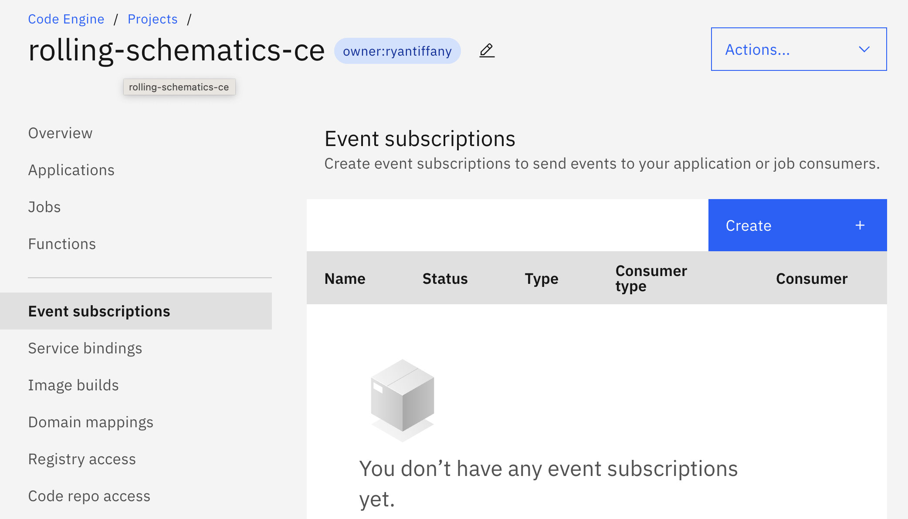
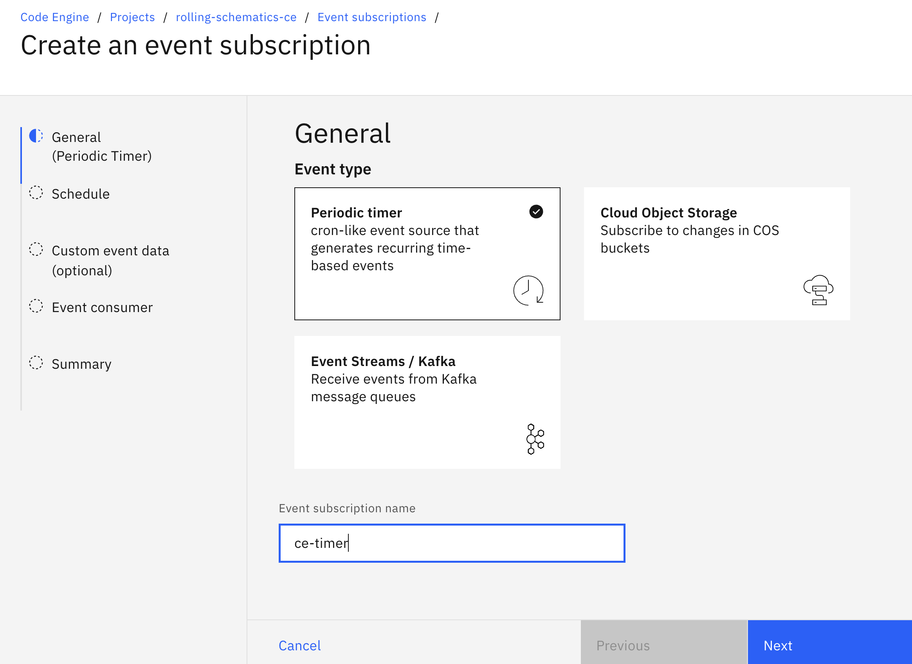
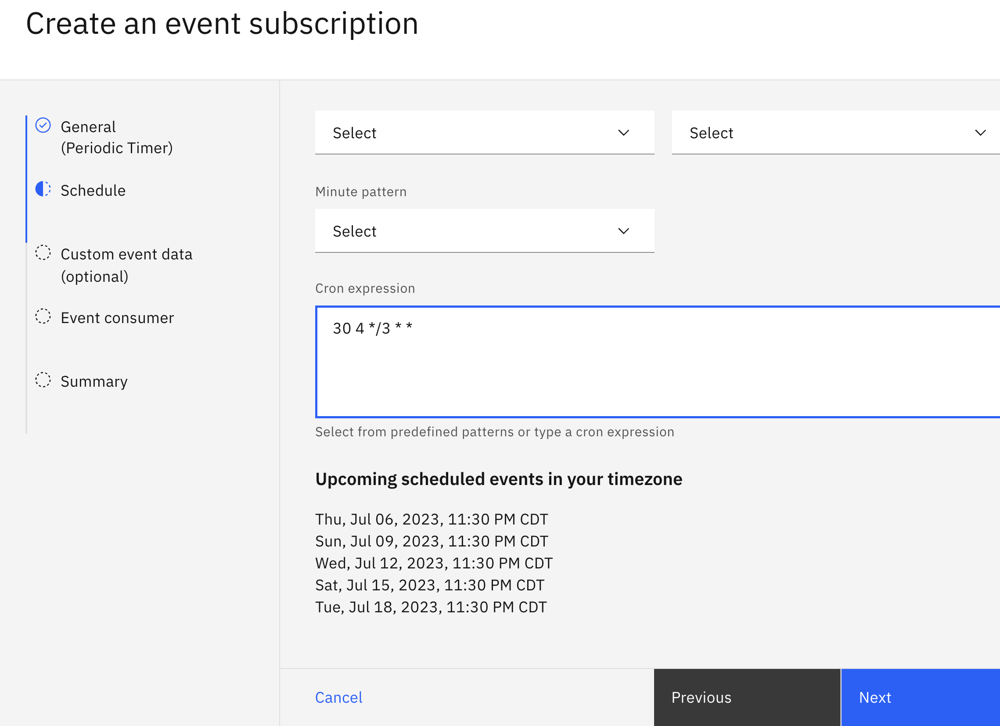

# Schedule Schematics refreshes using Code Engine

The `rollingIaaS.py` Python file is used to automate refreshing schematics workspaces. It is designed to be run as a Code Engine job.

## Prerequisites

The following environment variables will be needed when configuring the Code Engine Job:

- `IBMCLOUD_API_KEY`: IBM Cloud API key used to initiate the IAM authenticator.
- `WORKSPACE_ID`: The ID of the Schematics workspace where the server is deployed.
- `LOGDNA_INGESTION_KEY`: The LogDNA ingestion key for logging.

### Optional 

- If you would like to deploy resources via the CLI, please ensure you have the code engine plugin installed. `ibmcloud plugin install code-engine`
- The python script is set to use to the `us-south` endpoint for both Log Analysis and Schematics. Update these endpoints if you need to target different locations.  

## Steps

### Step 1: Create a new Code Engine project

#### Create project from the portal

1. Navigate to the [Code Engine UI](https://cloud.ibm.com/codeengine/overview).
2. Click the `Create project` button, give the project a name, select your resource group, and click `Create`.


#### Create project from the CLI

Before you can create a Code Engine project, you must first target a resource group.

```sh
ibmcloud target -g <resource-group>
```

Then, create the project. I highly recommend adding tags to your resources whenever possible for easier management, searching, and billing.

```sh
ibmcloud ce project create --name <project-name> --tag <project-tag>
```

**Example Output**

```sh
ibmcloud ce project create --name rolling-schematics-ce --tag "owner:ryantiffany"
Creating project 'rolling-schematics-ce'...
ID for project 'rolling-schematics-ce' is 'xxxxxx-c92e-xxxx-936b-xxxxx'.
Waiting for project 'rolling-schematics-ce' to be active...
```

The process will take a few moments to complete. Once it is finished, the CLI will automatically target the project, so it will be ready for the next step.

### Step 2: Create a Code Engine build using this repository as the source

The next steo is to set up a Code Engine build to pull this repository and build the container image. The container image will then be stored in the IBM Cloud Container Registry.

#### Create container build from the Portal

From the left hand Code Engine menu, click on `Image builds` and then click the `Create` button.


The build configuration process takes place in 3 menus: **Source**, **Strategy**, and **Output**. On the **Source** menu fill in the following fields and click `Next`:

- **Name**: A name for the build.
- **Code repo URL**: `https://github.com/cloud-design-dev/code-engine-schematics-cron.git`
- **Branch name**: `main`

On the **Strategy** menu, the only change I would recommend is selecting the **Small** profile under `Build resources`. The container image is very small, so it does not require much memory or CPU to build. Click `Next` when finished. This takes us our **Output** options, where the container will be stored. Select or fill in the following fields and click `Done` to complete the build configuration:

- **Registry server**: The IBM Cloud Container Registry server to use for storing your container images.
- **Registry access secret**: The IBM Cloud Container Registry access secret to use for storing your container images. This should be automatically populated.
- **Namespace**: The namespace to store the container image in. Ysou can select an existing namespace or create a new one.
- **Repository**: The name of the container image. This will be used in the next step when creating the Code Engine job.
- **Tag**: The tag to use for the container image.



Once the build is configured, you will land on the build details page. Click the `Submit build` button to start the intial container build process. When the build completes move on to creating our Code Engine job.

#### Create container build from the CLI (todo)

### Step 3: Create a Code Engine job using the build created in the previous step

#### Create code engine job from the portal

From the left-hand menu, click on `Jobs` and then the `Create` button.



Give the job a `Name` and click the `Configure Image` button to be taken to the Container selection menu. Select the image to use and click `Done`.



#### Create code engine job from the CLI (todo)

### Step 4: Configure the job with the environment variables listed above

With the image set, we now move on to adding the required variables. Scroll down to expand the `Environment Variables` section and click `Add`. 





Repeat the process for the `WORKSPACE_ID`, and `LOGDNA_INGESTION_KEY` variables and click `Create`.

### Step 5: Create schedules for the job to run at the desired intervals

To run our Code Engine job on a schedule we're going to subscribe to a `cron` event. From the left-hand menu, click on `Event subscriptions` and then `Create`. 



For **Event Type** select `Periodic Timer`, give the subscription a name and click `Next`.



Now we set the schedule for our trigger. You can select from pre-defined options or use `cron` syntax if you need something more complex. 



With the timer set, click `Next` until you get to the `Event consumer` option. Select **Job** from the `Component type`, and then select the previously defined Job name, click `Next` and then finally `Create`. 